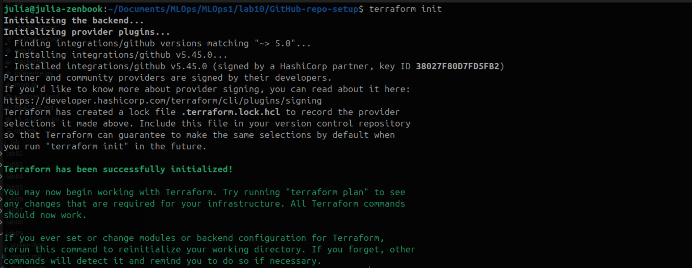
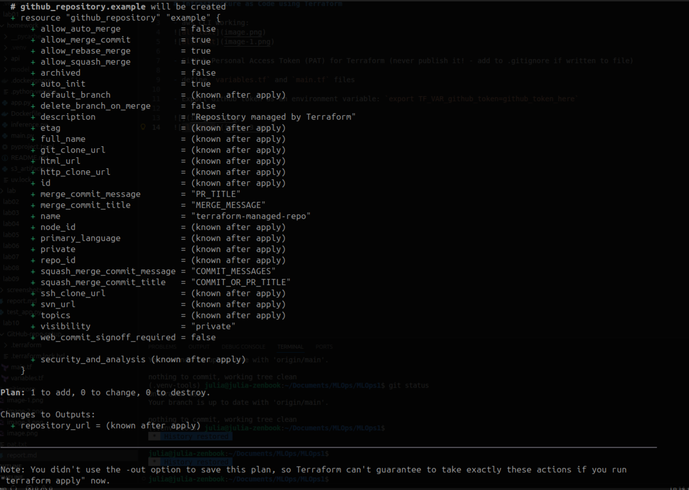
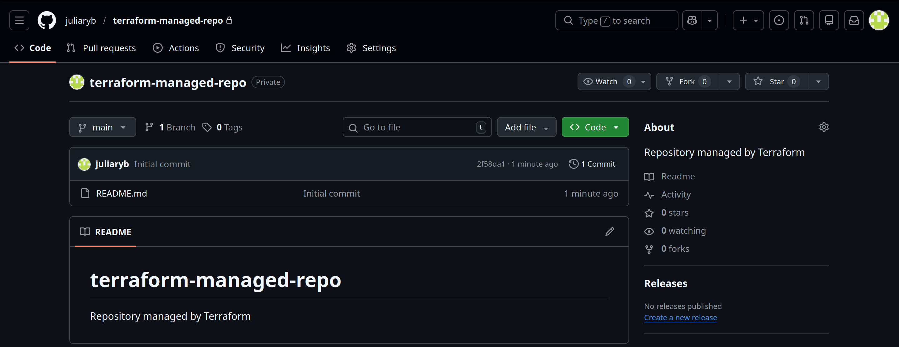
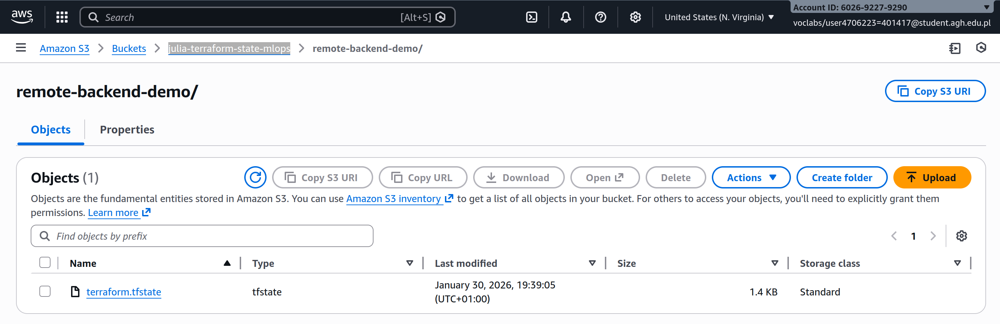
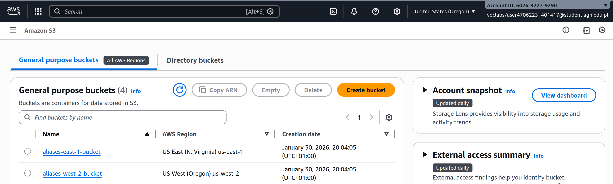

# Infrastructure as Code using Terraform

## Prerequisits
- aws CLI working:

- GitHub Personal Access Token (PAT) for Terraform (never publish it! - add to .gitignore if written to file)

## GitHub repository IaC setup

- define `variables.tf` and `main.tf` files

- Export GitHub token as an environment variable: `export TF_VAR_github_token=github_token_here`

after `terraform apply`:

- repo successfully created:

- then deleted with `terraform destroy`

### Exercse 1
Refactored files in `/GitHub-repo-refactor`.

## State management and remote backends
- created an S3 `julia-terraform-state-mlops`
- added `providers.tf` and `main.tf` to /remote-state
- results of `terraform apply` (remote state backend successfully configured)
 
- added `.terraform.lock.hcl` to each terraform folder in the repo

## Aliases 
Allows for multiple configurations of the same provider and selection of the provider configuration per resource. With aliasing Terraform becomes multi-region and scalable.
- added `providers.tf` and `main.tf` to /aliases
- results of `terraform apply` (buckets created successfuly)

Internally, Terraform now sees:
 - aws - AWS client configured for us-east-1
 - aws.us_west_2 - AWS client configured for us-west-2