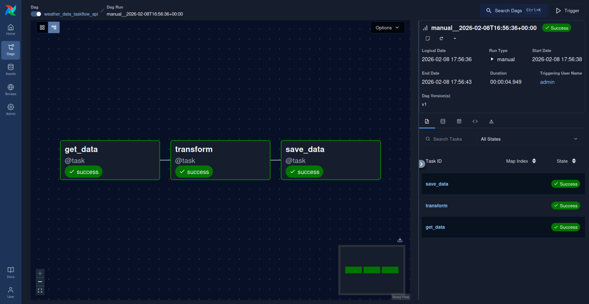
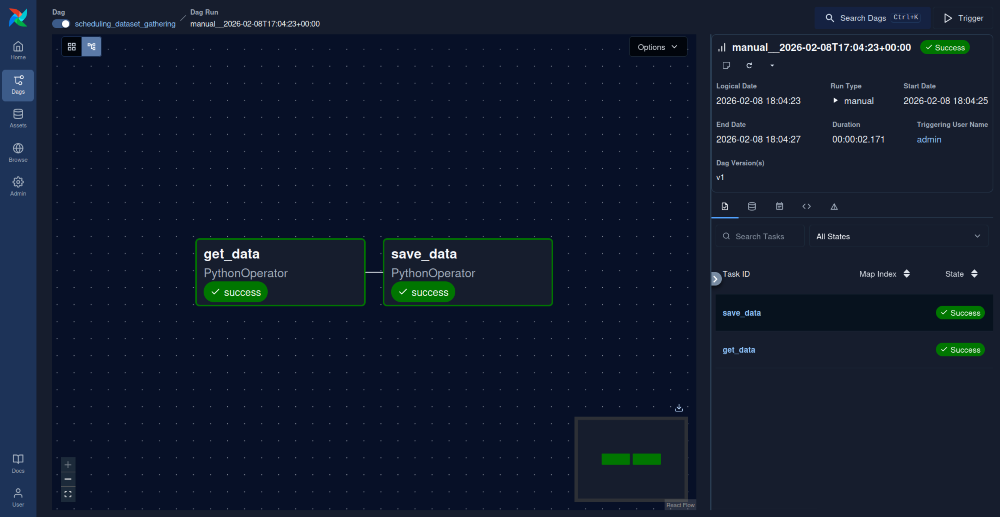

# Lab12 - ML pipelines
"This lab concerns creating ML pipelines, useful for organizing dataset creation and model training workflows. We will use Apache Airflow for this purpose, as arguably the most popular workflow orchestrator."

## Exercise 1
The TaskFlow API seems way more convinient than the traditional approach. UI preview:

### Schedulling and backfilling

I first set the date to yesterday, which was not enough to observe if the output made sense. When I switched to 2026-1-1, it turned out you need to delete DAG history for it to actually perform a catchup. Afterwards it did show earlier dates in the "Next run" column, but failed due to too many API calls.

## Exercise 2
The saving got stuck:

So the parameter `max_active_runs=1` was set, and then it worked:

But then realised there were duplicates and the end date should be calculated with timedelta(days=6) not 7. Then the resulting csv is correct.

## Exercise 3

